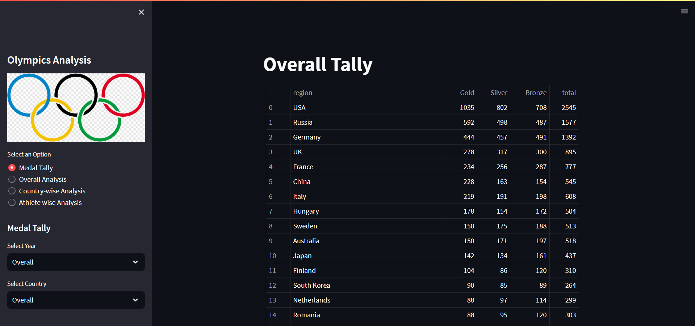

# Olympics Analysis Python Project

This Python project provides a comprehensive analysis of Olympics data, covering medal tallies, overall statistics, country-specific insights, and athlete-level evaluations.

## Features

- **Medal Tally Analysis:** Visualizes and summarizes the total number of medals won by each country.
- **Overall Analysis:** Offers a broad view of statistics and trends observed across various Olympic Games.
- **Country-wise Analysis:** Detailed breakdown of medal distributions and performances by country.
- **Athlete-wise Analysis:** Insights into individual athlete performances and achievements.



## Installation

1. Clone the repository:

   ```bash
   git clone https://github.com/mk0380/Olympics-Analysis.git
   cd Olympics-Analysis

2. Ensure you have Python 3.12.4 installed.
3. Install the required dependencies:

   ```bash
   pip install -r requirements.txt

4. Run the command to start locally:
   ```bash
   streamlit run app.py

## Support
  If you encounter any issues or have any questions, contact the project maintainer at [mayankkr21@iitk.ac.in].

  
